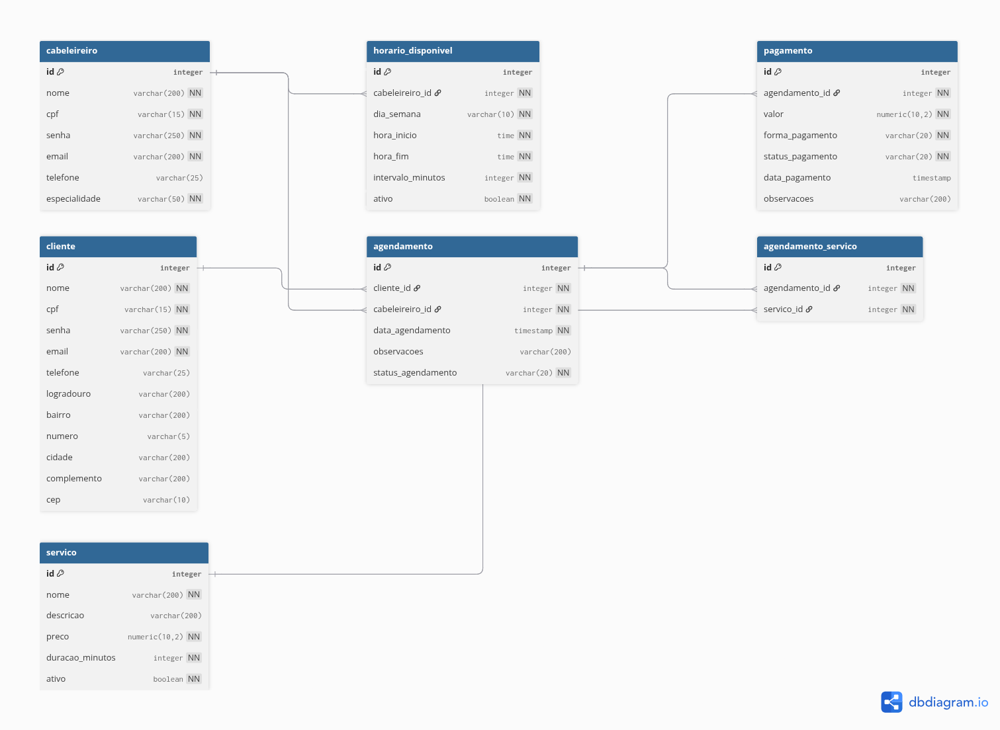
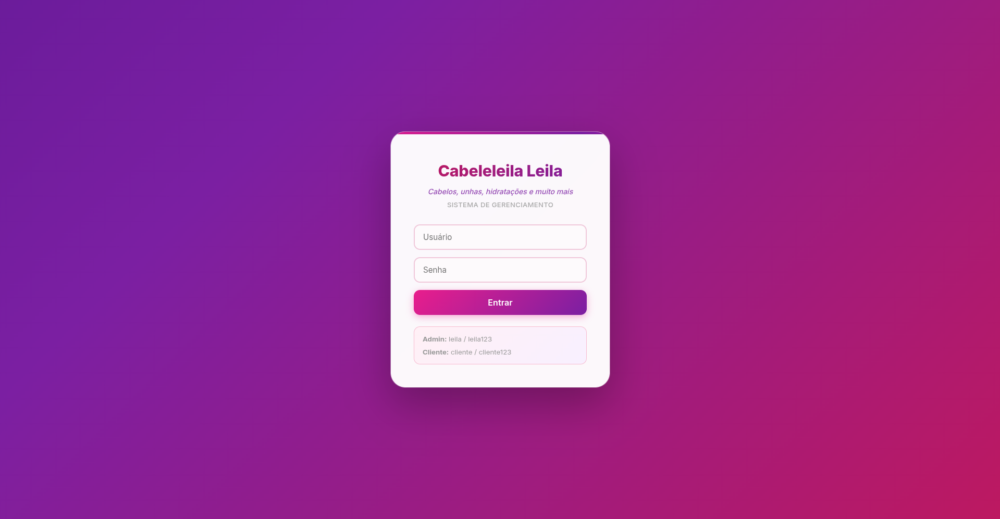
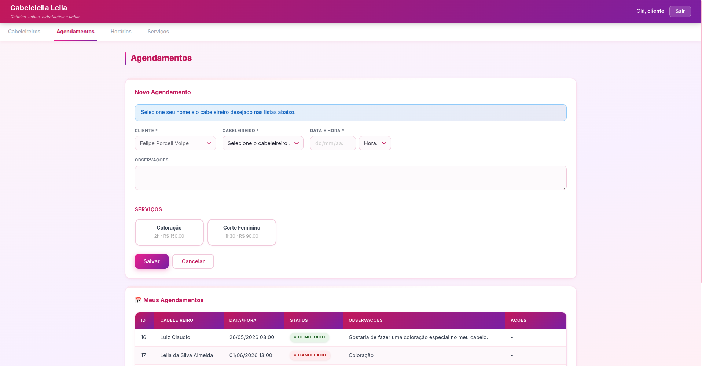

# Cabeleleila Leila — Sistema de Gerenciamento de Salão

API REST completa para gerenciamento de um salão de beleza, desenvolvida como avaliação técnica para a **DSIN**. O projeto cobre o ciclo completo de um salão: cadastro de clientes, cabeleireiros, serviços, agendamentos com múltiplos serviços, pagamentos e relatórios, com um frontend web embutido na própria aplicação.

---

## Demonstração

### Modelo Entidade-Relacionamento



### Documentação — Swagger UI


### Sistema

**Login**


**Agendamentos**


**Relatórios**


### Vídeo de demonstração

<!-- Substitua o link abaixo pelo vídeo de demonstração -->
[](docs/video/demo.mp4)

---

## Tecnologias

| Camada | Tecnologia | Versão |
|---|---|---|
| Linguagem | Java | 21 |
| Framework | Spring Boot | 4.0.6 |
| Segurança | Spring Security (HTTP Basic) | — |
| Persistência | Spring Data JPA / Hibernate | — |
| Banco de dados | PostgreSQL | 17 |
| Mapeamento de objetos | MapStruct | 1.5.5 |
| Redução de boilerplate | Lombok | 1.18.30 |
| Documentação da API | SpringDoc OpenAPI (Swagger UI) | 2.8.8 |
| Validação | Jakarta Bean Validation / Hibernate Validator | 3.0 / 8.0 |
| Build | Maven | — |
| Infra | Docker / Docker Compose | — |
| Frontend | HTML5 + CSS3 + JavaScript (vanilla) | — |

---

## Arquitetura

A aplicação segue uma arquitetura em camadas clássica, com separação clara de responsabilidades:

```
HTTP Request
    │
    ▼
Controller          ← recebe e valida a requisição (Bean Validation)
    │
    ▼
Validator           ← regras de negócio transversais (conflitos, permissões por role)
    │
    ▼
Service             ← orquestra a operação, coordena repositórios
    │
    ▼
Repository          ← Spring Data JPA + Specifications para filtros dinâmicos
    │
    ▼
Model / Entity      ← mapeado para o banco via JPA/Hibernate
    │
    ▼
MapStruct Mapper    ← converte entre Entity e DTO (request/response)
    │
    ▼
DTO                 ← objeto de transferência retornado ao cliente
```

**Pontos de destaque da arquitetura:**

- **Specifications** (`JpaSpecificationExecutor`): filtros dinâmicos combinados com `Specification.and()`, evitando múltiplas queries.
- **Global Exception Handler** (`@RestControllerAdvice`): centraliza o tratamento de erros e retorna respostas padronizadas com campo, mensagem e código HTTP.
- **Validação de conflito de agenda**: o `AgendamentoValidator` verifica, antes de persistir, se o cabeleireiro já possui um agendamento ativo no mesmo horário — garantindo que nenhum horário seja duplicado e que o cliente seja informado de horários alternativos disponíveis.

---

## Estrutura de diretórios

```
cabeleleila-leila/
├── docker-compose.yml
└── demo/
    ├── pom.xml
    └── src/
        └── main/
            ├── java/com/cabeleleilaleila/demo/
            │   ├── CabeleleilaleilaApplication.java
            │   ├── common/
            │   │   └── GlobalExceptionHandler.java      # @RestControllerAdvice
            │   ├── config/
            │   │   ├── SecurityConfig.java              # HTTP Basic, roles, permissões
            │   │   └── SwaggerConfig.java               # Configuração OpenAPI
            │   ├── controller/
            │   │   ├── AgendamentoController.java
            │   │   ├── CabeleireiroController.java
            │   │   ├── ClienteController.java
            │   │   ├── HorarioDisponivelController.java
            │   │   ├── PagamentoController.java
            │   │   ├── RelatorioController.java
            │   │   └── ServicoController.java
            │   ├── dto/                                 # DTOs de request, response e erro
            │   ├── exception/                           # Exceções de domínio customizadas
            │   ├── mapper/                              # MapStruct (Entity ↔ DTO)
            │   ├── model/
            │   │   ├── enums/                           # StatusAgendamento, FormaPagamento, etc.
            │   │   ├── Agendamento.java
            │   │   ├── AgendamentoServico.java          # Tabela de junção N:N
            │   │   ├── Cabeleireiro.java
            │   │   ├── Cliente.java
            │   │   ├── HorarioDisponivel.java
            │   │   ├── Pagamento.java
            │   │   └── Servico.java
            │   ├── repository/                          # Interfaces Spring Data JPA
            │   ├── service/
            │   │   ├── impl/                            # Implementações dos serviços
            │   │   └── (interfaces)
            │   ├── specification/                       # Filtros dinâmicos JPA Criteria
            │   └── validator/                           # Regras de negócio e validações
            └── resources/
                ├── application.properties
                └── static/
                    ├── index.html                       # Frontend SPA (single page)
                    ├── css/style.css
                    └── js/app.js
```

---

## Documentação da API (Swagger)

A documentação interativa é gerada automaticamente pelo **SpringDoc OpenAPI** e fica disponível em:

```
http://localhost:8080/swagger-ui/index.html
```

Todos os endpoints estão anotados com `@Tag`, `@Operation` e `@ApiResponse`, descrevendo parâmetros, exemplos de request/response e códigos de retorno esperados. Para testar endpoints protegidos diretamente no Swagger UI, clique em **Authorize** e informe as credenciais de acesso.

---

## Controle de acesso

A autenticação usa **HTTP Basic** com dois perfis distintos:

| Perfil | Usuário | Senha | Permissões |
|---|---|---|---|
| Administrador | `leila` | `leila123` | Acesso total a todos os endpoints |
| Cliente | `cliente` | `cliente123` | Consultar clientes, criar/editar/cancelar agendamentos próprios |

Recursos estáticos (frontend) e o Swagger UI são públicos, sem necessidade de autenticação.

---

## Variáveis de ambiente

A aplicação lê as configurações de banco via variáveis de ambiente. Elas devem estar definidas antes de executar — seja no sistema operacional, no arquivo `.env`, ou nas configurações de execução da IDE.

| Variável | Valor padrão (Docker Compose) |
|---|---|
| `DB_URL` | `jdbc:postgresql://localhost:5432/cabeleleilaleila` |
| `DB_USERNAME` | `cabeleleilaleila` |
| `DB_PASSWORD` | `cabeleleilaleila` |

**Configurando na IDE (IntelliJ IDEA / Eclipse):**
Nas configurações de execução da aplicação (`Run/Debug Configurations`), adicione as três variáveis na aba **Environment variables**:

```
DB_URL=jdbc:postgresql://localhost:5432/cabeleleilaleila;DB_USERNAME=cabeleleilaleila;DB_PASSWORD=cabeleleilaleila
```

Sem essas variáveis definidas, a aplicação nao conseguirá se conectar ao banco e falhará na inicialização.

---

## Implantação com Docker Compose

### Pré-requisitos

- Docker e Docker Compose instalados
- Java 21 e Maven instalados (para rodar a aplicação)
- Variáveis de ambiente `DB_URL`, `DB_USERNAME` e `DB_PASSWORD` configuradas (ver seção acima)

### Passo a passo

**1. Suba o banco de dados e o pgAdmin:**

```bash
docker compose up -d
```

Isso inicializa:
- **PostgreSQL 17** na porta `5432`
- **pgAdmin 4** na porta `5050`

**2. Compile e execute a aplicação:**

```bash
cd demo
mvn spring-boot:run
```

Ou, para gerar e rodar o JAR:

```bash
cd demo
mvn clean package -DskipTests
java -jar target/demo-0.0.1-SNAPSHOT.jar
```

**3. Acesse:**

| Recurso | URL |
|---|---|
| Frontend (sistema web) | `http://localhost:8080` |
| Swagger UI | `http://localhost:8080/swagger-ui/index.html` |
| pgAdmin | `http://localhost:5050` |

### Credenciais do banco e pgAdmin

| Serviço | Dado | Valor |
|---|---|---|
| PostgreSQL | Host | `localhost:5432` |
| PostgreSQL | Usuário / Senha / Database | `cabeleleilaleila` / `cabeleleilaleila` / `cabeleleilaleila` |
| pgAdmin | Login | `leila@leila.com.br` |
| pgAdmin | Senha | `leila` |

> O schema é criado automaticamente pelo Hibernate (`spring.jpa.hibernate.ddl-auto`) na primeira inicialização da aplicação.

---

## Principais endpoints

| Recurso | Método | Rota | Descrição |
|---|---|---|---|
| Clientes | `POST` | `/clientes` | Cadastrar cliente |
| Clientes | `GET` | `/clientes` | Listar/filtrar clientes (paginado) |
| Cabeleireiros | `POST` | `/cabeleireiros` | Cadastrar cabeleireiro |
| Cabeleireiros | `GET` | `/cabeleireiros` | Listar cabeleireiros com filtros |
| Servicos | `POST` | `/servicos` | Cadastrar serviço com preço |
| Agendamentos | `POST` | `/agendamentos` | Criar agendamento (múltiplos serviços) |
| Agendamentos | `PATCH` | `/agendamentos/{id}/confirmar` | Confirmar agendamento |
| Agendamentos | `PATCH` | `/agendamentos/{id}/cancelar` | Cancelar agendamento |
| Agendamentos | `PATCH` | `/agendamentos/{id}/concluir` | Concluir agendamento |
| Agendamentos | `GET` | `/agendamentos/historico` | Histórico por cliente e período |
| Agendamentos | `GET` | `/agendamentos/dia` | Agendamentos por intervalo de datas |
| Pagamentos | `GET` | `/pagamentos` | Listar pagamentos com filtros |
| Pagamentos | `PATCH` | `/pagamentos/{id}/pagar` | Registrar pagamento |
| Relatórios | `GET` | `/relatorios/faturamento` | Faturamento por período |
| Relatórios | `GET` | `/relatorios/semanal` | Resumo semanal de agendamentos |
| Horários | `POST` | `/horarios-disponiveis` | Cadastrar horário disponível |

A lista completa, com parâmetros e exemplos, está no Swagger UI.
